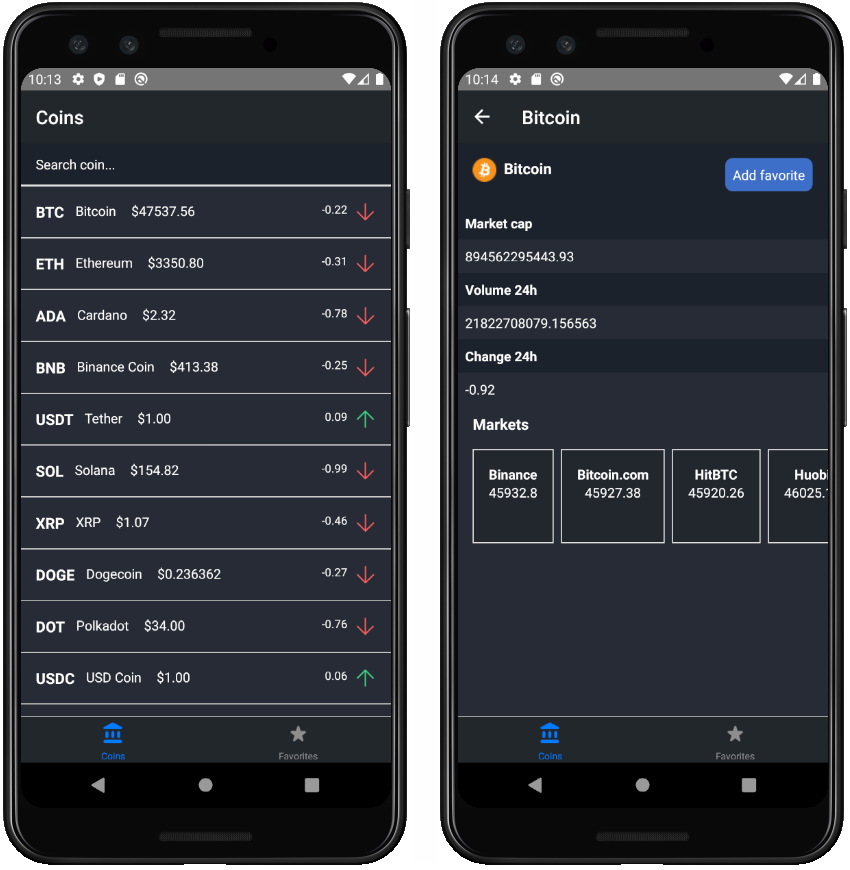

# Crypto Tracker 📈

Check original cryptocurrency/coin prices and other metrics. Built with React Native.
  

   

## Overview 🔎

### The project

Users are able to:

- View all cryptocurrencies including info price, market cap, volume and change in the last 24 hours, markets and more.
- Search cryptocurrencies by name or symbol.
- Save / remove favorites cryptocurrencies and view them in the favorites section.

## My process 👨‍💻

### Built with

- [React Native](https://reactnative.dev/) - JavaScript framework.
- [Async Storage](https://github.com/react-native-async-storage/async-storage) - Storage system for React Native.
- [Bottom Tabs Navigator](https://reactnavigation.org/docs/bottom-tab-navigator/) - Package for tab bar.
- [ESLint](https://eslint.org/) - JavaScript Linter.

## Author 🐱‍👤

- Website - https://gerardoramirez.netlify.app/
- Twitter - [@g3rardogo](https://twitter.com/g3rardogo)
